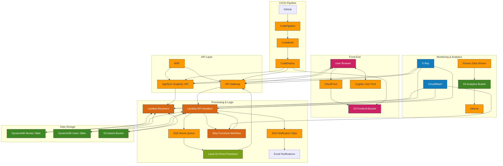

# AWS Developer Movie Portal

A movie tracking portal built with AWS services.

## Overview

This project implements a full-stack application that allows users to track movies they've watched. It leverages multiple AWS services to demonstrate AWS Developer certification concepts while keeping costs minimal by utilizing AWS Free Tier services where possible.

## Architecture



The application uses a serverless architecture with the following components:

### Frontend

- **AWS Amplify**: Hosting and continuous deployment
- **Amazon CloudFront**: Content delivery network
- **Amazon Cognito**: User authentication and management

### Backend

- **AWS AppSync**: GraphQL API for real-time data
- **Amazon API Gateway**: RESTful API endpoints
- **AWS Lambda**: Serverless function execution
- **Amazon DynamoDB**: NoSQL database for storing movie data
- **Amazon S3**: Object storage for movie images and assets

### Processing Pipeline

- **Amazon SQS**: Queue for movie processing tasks
- **Amazon SNS**: Notifications for processed movies
- **AWS Step Functions**: Movie processing workflow orchestration

### CI/CD Pipeline

- **AWS CodePipeline**: Continuous integration and deployment
- **AWS CodeBuild**: Automated build process
- **AWS CodeCommit**: Source code repository (mirrored from GitHub)

### Monitoring and Analysis

- **Amazon CloudWatch**: Monitoring and logging
- **AWS X-Ray**: Tracing and performance analysis
- **Amazon Athena**: SQL queries against data in S3

## Repository Structure

```
aws-movie-portal/
├── .github/
│   └── workflows/         # GitHub Actions workflows
├── cdk/                   # Infrastructure as Code using AWS CDK
│   ├── bin/               # CDK app entry point
│   ├── lib/               # Stack definitions
│   └── test/              # CDK tests
├── backend/
│   ├── functions/         # Lambda functions
│   │   ├── api/           # API handlers
│   │   ├── auth/          # Authentication handlers
│   │   └── processing/    # Movie processing handlers
│   ├── graphql/
│   │   ├── schema/        # GraphQL schema definitions
│   │   └── resolvers/     # GraphQL resolvers
│   └── step-functions/    # Step Functions workflow definitions
├── frontend/
│   ├── public/            # Static assets
│   ├── src/
│   │   ├── components/    # React components
│   │   ├── graphql/       # GraphQL queries and mutations
│   │   ├── hooks/         # Custom React hooks
│   │   ├── pages/         # Application pages
│   │   └── utils/         # Utility functions
│   └── amplify/           # Amplify configuration
├── scripts/               # Deployment and utility scripts
├── local-processor/       # On-premises movie processing application
└── docs/                  # Additional documentation
```

## AWS Services Used

This project demonstrates the following AWS services:

### Core Services

- **Amazon S3**: Storage for movie images and assets
- **Amazon DynamoDB**: NoSQL database for movie data
- **AWS Lambda**: Serverless computing for API and processing functions
- **Amazon API Gateway**: RESTful API endpoints
- **AWS AppSync**: GraphQL API with real-time features

### Integration Services

- **Amazon SQS**: Queue for movie processing tasks
- **Amazon SNS**: Notifications for processed movies
- **Amazon EventBridge**: Event routing between components
- **AWS Step Functions**: Orchestration of movie processing workflow

### Frontend & Authentication

- **AWS Amplify**: Frontend hosting and deployment
- **Amazon CloudFront**: Content delivery network
- **Amazon Cognito**: User authentication and management
- **AWS WAF**: Web application firewall protection

### Development & Deployment

- **AWS CDK**: Infrastructure as Code
- **AWS CloudFormation**: Provisioning resources
- **AWS CodePipeline**: CI/CD pipeline
- **AWS CodeBuild**: Building and testing code
- **AWS CodeDeploy**: Automated deployment

### Monitoring & Analysis

- **Amazon CloudWatch**: Monitoring and logging
- **AWS X-Ray**: Tracing and performance analysis
- **Amazon Athena**: SQL queries on S3 data

## Getting Started

### Prerequisites

- AWS Account
- [AWS CLI](https://aws.amazon.com/cli/) installed and configured
- [Node.js](https://nodejs.org/) (v14 or later)
- [AWS CDK](https://aws.amazon.com/cdk/) installed (`npm install -g aws-cdk`)
- [Git](https://git-scm.com/)


### environment preparation:

```sh
# Instalar o AWS CDK
npm install -g aws-cdk

# Inicializar um projeto CDK
mkdir movie-portal && cd movie-portal
cdk init app --language typescript

# Configurar credenciais AWS
aws configure
```


### Installation

1. Clone the repository:

   ```bash
   git clone https://github.com/yourusername/aws-movie-portal.git
   cd aws-movie-portal
   ```

2. Install dependencies:

   ```bash
   # Install CDK dependencies
   cd cdk
   npm install
   cd ..
   
   # Install frontend dependencies
   cd frontend
   npm install
   cd ..
   
   # Install local processor dependencies
   cd local-processor
   npm install
   cd ..
   ```

3. Bootstrap your AWS environment (if not already done):

   ```bash
   cd cdk
   cdk bootstrap
   ```

4. Deploy the infrastructure:

   ```bash
   cdk deploy
   ```

5. Note the outputs from the deployment, including API endpoints and resource names.

### Local Development

To run the frontend locally:

```bash
cd frontend
npm start
```

To run the local movie processor:

```bash
cd local-processor
npm start
```

## Configuration

### Environment Variables

Create a `.env` file in the project root with the following variables:

```
# AWS Region
AWS_REGION=us-east-1

# API Endpoints (from CDK output)
API_GATEWAY_URL=https://your-api-gateway-url.execute-api.us-east-1.amazonaws.com/dev
APPSYNC_URL=https://your-appsync-url.appsync-api.us-east-1.amazonaws.com/graphql
APPSYNC_API_KEY=your-appsync-api-key

# User Authentication
USER_POOL_ID=us-east-1_your-user-pool-id
USER_POOL_CLIENT_ID=your-user-pool-client-id

# Resources
MOVIES_TABLE=your-movies-table-name
ASSETS_BUCKET=your-assets-bucket-name
PROCESSING_QUEUE_URL=https://sqs.us-east-1.amazonaws.com/your-account-id/your-queue-name
```

## Usage

### Managing Movies

1. Sign up and log in to the application using your email.
2. Add a new movie to your watched list with basic information.
3. The application will queue the movie for processing by your local processor.
4. The local processor will enrich the movie data with actors, ratings, etc.
5. Once processed, the movie will appear in your list with complete information.

### Viewing Analytics

1. Navigate to the Analytics section to view insights about your movie watching habits.
2. See statistics on genres, directors, and ratings.

## Local Processing Application

The local processor is responsible for enriching movie data. It:

1. Polls the SQS queue for new movies to process
2. Enriches the data with additional information (actors, reviews, etc.)
3. Sends the processed data back to the AWS backend via API Gateway

To run the processor:

```bash
cd local-processor
npm start
```

## Deployment

### Automatic Deployment

The project uses GitHub Actions to automatically deploy changes:

1. Push changes to the `main` branch
2. GitHub Actions will build and test the code
3. Changes will be automatically deployed to AWS

### Manual Deployment

To deploy manually:

```bash
# Deploy infrastructure
cd cdk
cdk deploy

# Deploy frontend
cd ../frontend
npm run build
aws s3 sync build/ s3://your-frontend-bucket
```

## Cost Optimization

This project is designed to minimize AWS costs by:

1. Using serverless components where possible
2. Leveraging AWS Free Tier services
3. Setting up appropriate alarms and budgets
4. Processing higher-intensity operations locally

## AWS Developer Certification Topics Covered

This project demonstrates key concepts from the AWS Developer certification:

- Developing and deploying applications on AWS
- Working with AWS APIs and SDKs
- Implementing authentication and authorization
- Using AWS managed services
- Implementing application security
- Troubleshooting and optimizing applications on AWS

## Contributing

1. Fork the repository
2. Create a feature branch: `git checkout -b feature/new-feature`
3. Commit your changes: `git commit -am 'Add new feature'`
4. Push to the branch: `git push origin feature/new-feature`
5. Submit a pull request

## License

This project is licensed under the MIT License - see the LICENSE file for details.
